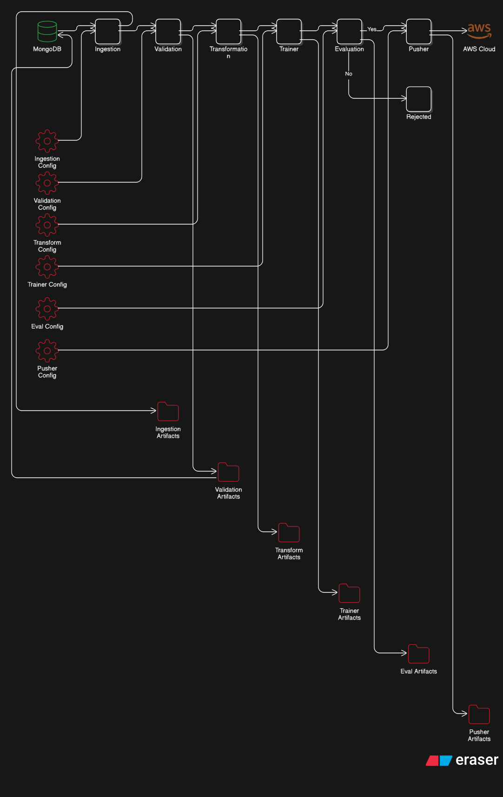
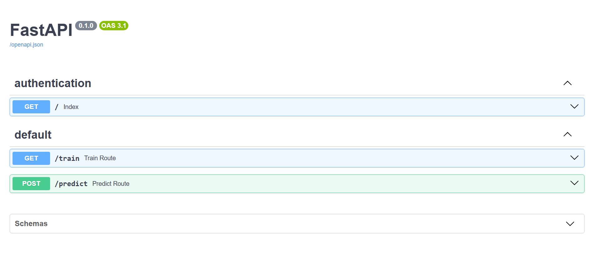
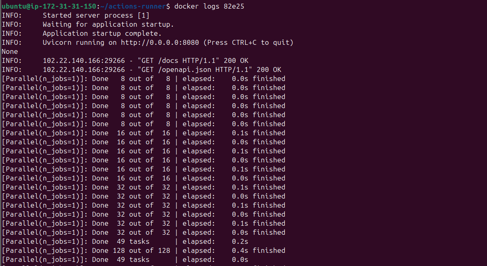
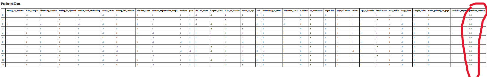

# 🛡️ PhishNet: Intelligent Phishing Detection System

[](https://emergingtalents.mit.edu/)
[](https://www.python.org/)
[](https://fastapi.tiangolo.com/)
[](https://www.docker.com/)
[](https://aws.amazon.com/)
[](https://mlflow.org/)
[](https://www.mongodb.com/)

> **"In a digital world where a single click can compromise an entire network, PhishNet stands as the first line of defense."**

---

## 📑 Table of Contents

- [📍 About The Project](#-about-the-project)
- [🔍 How It Works](#-how-it-works)
- [🚀 Tech Stack](#-tech-stack)
- [🏗️ Architecture](#-architecture)
- [💻 Getting Started](#-getting-started)
- [🎓 MIT Emerging Talents](#-mit-emerging-talents)

---

## 📍 About The Project

**PhishNet** is a sophisticated machine learning solution designed to detect malicious phishing websites in real-time. Developed as part of the **MIT Emerging Talents Experiential Learning Opportunity (ELO)**, this project bridges the gap between cybersecurity and artificial intelligence.

Phishing attacks are becoming increasingly subtle, often bypassing traditional filters. PhishNet analyzes **30+ distinct features** of a URL—ranging from domain characteristics to web traffic patterns—to classify it as legitimate or malicious with high precision.

### Why This Matters?

Cybersecurity threats are evolving. By leveraging historical data and behavioral patterns, PhishNet provides a proactive approach to identifying threats before they cause harm.

---

## 🔍 The Logic: Features & Data

The core of PhishNet is its ability to analyze **11,055 data points**, each representing a website with **30 distinct features**. These features are meticulously extracted to capture the behavioral and structural fingerprints of phishing attempts.

### Key Features Analyzed

The model looks at three main categories of features (see full list in [`data_schema/schema.yaml`](data_schema/schema.yaml)):

1. **Address Bar Based Features**:
    - `having_IP_Address`: Is the domain an IP address? (e.g., `123.45.67.89`)
    - `URL_Length`: Is the URL suspiciously long?
    - `Shortining_Service`: Does it use bit.ly, goo.gl, etc.?
    - `having_At_Symbol`: Does it contain `@` to confuse browsers?

2. **Abnormal Based Features**:
    - `Request_URL`: What % of external objects (images, videos) are loaded from other domains?
    - `URL_of_Anchor`: Do `<a>` tags point to different domains?
    - `Links_in_tags`: Do `<meta>`, `<script>`, `<link>` tags point to the same domain?

3. **Domain Based Features**:
    - `SSLfinal_State`: Does it have a valid HTTPS certificate?
    - `Domain_registeration_length`: Is the domain very new? (Phishing sites are often short-lived).
    - `age_of_domain`: How long has the domain existed?

---

## 🏗️ MLOps Architecture & Pipeline

PhishNet is built on a **Recurrent Pipeline Architecture**. This ensures that every stage of the machine learning lifecycle is modular, reproducible, and traceable.



### The Recurrent Flow

The system uses a strict **Config -> Component -> Artifact** pattern:

1. **Configuration (`entity/config_entity.py`)**: Each component (e.g., Data Ingestion) has a specific configuration defining inputs, outputs, and parameters.
2. **Component Execution**: The component reads its config, performs its task (e.g., splitting data), and produces an **Artifact**.
3. **Artifact Generation (`entity/artifact_entity.py`)**: The output (e.g., `train.csv`, `test.csv`) is stored as an object.
4. **Recurrence**: The **Artifact** of one component becomes the **Input** for the next.
    - *Example*: `DataIngestionArtifact` -> feeds into -> `DataValidationComponent`.

### The Pipeline Stages

1. **Data Ingestion**: Connects to MongoDB, fetches the 11k+ records, and splits them into Train/Test sets.
2. **Data Validation**: Validates the schema against `schema.yaml` to ensure no data drift.
3. **Data Transformation**: Handles missing values, scales numerical features, and prepares the data for the model.
4. **Model Training**: Trains multiple models (Random Forest, Decision Tree, Gradient Boosting, AdaBoost) and selects the best one based on accuracy.
5. **Model Evaluation**: Logs performance metrics to **MLflow** and **DagsHub**.

---

## ⚡ Application Interface (FastAPI)

The project exposes a high-performance REST API built with **FastAPI**.

### 1. Interactive Prediction

The `/predict` endpoint allows users to upload a CSV file containing URL features.
- **Input**: A CSV file (use [`valid_data/test.csv`](valid_data/test.csv) for testing).
- **Process**: The system loads the saved model and preprocessor artifacts.
- **Output**: An HTML table displaying the original data alongside a new `predicted_column` (**0 for Phishing**, **1 for Safe**).



### 2. Continuous Training

The `/train` endpoint allows administrators to trigger the entire training pipeline with a single click. This is crucial for updating the model as new phishing patterns emerge.



---

## 🔄 CI/CD Pipeline: From Push to Production

The project utilizes a robust **Continuous Integration and Continuous Deployment (CI/CD)** pipeline powered by GitHub Actions and AWS.

### The Automation Flow

1. **Push to GitHub**: A developer pushes code changes to the `main` branch.
2. **Continuous Integration (CI)**:
    - GitHub Actions triggers the workflow.
    - **Linting**: Checks code quality.
    - **Unit Tests**: Runs tests to ensure functionality.
3. **Continuous Delivery (CD)**:
    - **Build**: A new Docker image is built from the `Dockerfile`.
    - **Push to Registry**: The image is tagged and pushed to **AWS Elastic Container Registry (ECR)**.
4. **Continuous Deployment**:
    - **Self-Hosted Runner**: An AWS EC2 instance (acting as a self-hosted runner) pulls the latest image from ECR.
    - **Deployment**: The old container is removed, and the new version is deployed with `restart: always` policies.
    - **Live URL**: The application is immediately available at [http://18.202.196.247/docs](http://18.202.196.247/docs).

---

## 💻 Getting Started & Usage Guide

### Prerequisites

* Docker
- Python 3.10+
- MongoDB Connection String

### 🧪 How to Test the Model

1. **Start the Server**: Follow the installation steps below to get the Docker container running.
2. **Open the UI**: Navigate to `http://localhost:8080/docs` or the deployed URL.
3. **Locate `/predict`**: Click on the `POST /predict` endpoint.
4. **Upload Data**:
    - Click "Try it out".
    - Upload the file located at [`valid_data/test.csv`](valid_data/test.csv) in this repository.
5. **Execute**: Click "Execute".
6. **View Results**: The API will return a rendered HTML table showing which URLs were detected as malicious.



### Local Installation

1. **Clone the repository**

    ```bash
    git clone https://github.com/Bikaze/elo-project.git
    cd elo-project
    ```

2. **Set up Environment Variables**
    Create a `.env` file:

    ```bash
    MONGO_DB_URL="your_mongodb_connection_string"
    AWS_ACCESS_KEY_ID="your_aws_key"
    AWS_SECRET_ACCESS_KEY="your_aws_secret"
    AWS_REGION="us-east-1"
    ```

3. **Run with Docker**

    ```bash
    docker build -t phishnet .
    docker run -p 8080:8080 --env-file .env phishnet
    ```

4. **Access the API**
    Open your browser to `http://localhost:8080/docs` to test the prediction endpoint.

---

## 🎓 MIT Emerging Talents

This project was developed as a capstone for the **MIT Emerging Talents** program. The program empowers talented individuals from marginalized backgrounds with the skills and network to become leaders in the tech industry.

- **Program**: Experiential Learning Opportunity (ELO)
- **Focus**: Data Science & Machine Learning Engineering
- **Goal**: To apply theoretical knowledge to solve real-world problems using industry-standard tools and practices.

---

<p align="center">
  Made with ❤️ by Bikaze
</p>
